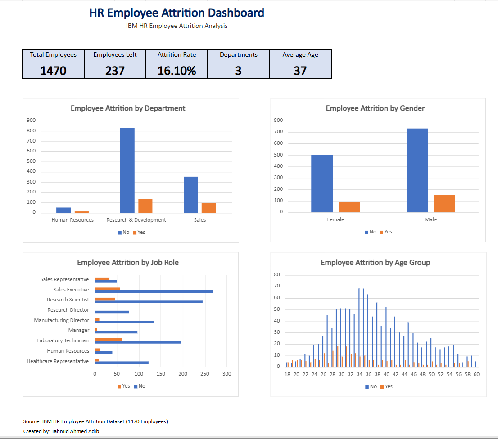

# HR Employee Attrition Dashboard

## Project Overview
This project analyzes employee attrition using the IBM HR Employee Attrition dataset. The dashboard was built entirely in Microsoft Excel using Pivot Tables, Pivot Charts, KPIs, and Exploratory Data Analysis (EDA).

The goal of the project is to identify trends in employee turnover and present the findings in an interactive dashboard.

---

## Project Objectives

- Analyze employee attrition trends.
- Compare attrition across departments, gender, job roles, age groups, overtime, and income.
- Build an interactive Excel dashboard using Pivot Tables and Pivot Charts.
- Present key HR metrics through KPI cards.

---

## Dashboard Preview

---

## Dataset

- Dataset: IBM HR Employee Attrition Dataset
- Total Employees: 1,470
- Employees Left: 237
- Attrition Rate: 16.10%

---

## Dashboard KPIs

- Total Employees
- Employees Left
- Attrition Rate
- Number of Departments
- Average Employee Age

---

## Analysis Performed

- Department Analysis
- Gender Analysis
- Job Role Analysis
- Age Group Analysis
- Overtime Analysis
- Monthly Income Analysis
- Exploratory Data Analysis (EDA)

---

## Excel Skills Used

- Pivot Tables
- Pivot Charts
- KPI Dashboard Design
- Data Cleaning
- Exploratory Data Analysis (EDA)
- COUNTIF / COUNTIFS
- AVERAGE
- Cell Formatting
- Conditional Formatting
- Data Visualization

---

## Key Insights

- Research & Development had the largest workforce.
- Employees working overtime showed higher attrition.
- Sales-related roles experienced relatively high employee turnover.
- Most employees were between 30–40 years old.
- Overall attrition rate was 16.10%.

---

## Project Structure

- Dashboard
- Data Cleaning Log
- EDA
- Data Dictionary
- Pivot Tables
- Department Analysis
- Gender Analysis
- Job Role Analysis
- Age Group Analysis
- Overtime Analysis
- Income Analysis
- Raw Data

---

## Files Included

- HR_Employee_Attrition_Analysis.xlsx
- dashboard.png
- README.md
  
---

## Tools Used

- Microsoft Excel
- Pivot Tables
- Pivot Charts
- GitHub

---

## License
This project is for educational and portfolio purposes.

Created by **Tahmid Ahmed Adib**
